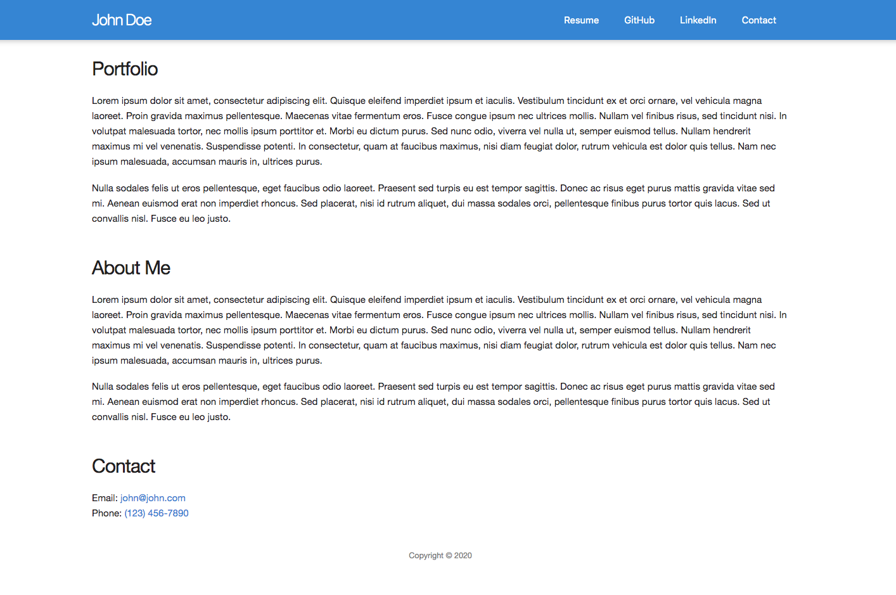

# 1.2 JSX

In this activity we are going to convert HTML to ReactJS using JSX Syntax.

## Folder Setup & Installation

If you have done this in a previous exercise, you may be able to skip some steps below such as the creation of the `reactworkshop` folder.

* Create a folder called `reactworkshop` separate from this repository that you can use for all of the activities throughout the lesson.

* If this is the first exercise you are working on, copy the entire contents of the [Unsolved](Unsolved) folder and paste it into your `reactworkshop` folder. Otherwise, you just need to copy and paste the [Unsolved/src](Unsolved/src) folder.

* Since these activities were all built using Create React App all we will need to do is `npm install` once and then copy and paste the `src` folders for each.

	* NOTE: You do NOT need to run Create React App in order to do these exercises. All you will need to do is install the dependencies in the provided node package.json file.

* Install node packages by running the command `npm install` from within the `reactworkshop` folder.

* Stop the dev server if it is already running. Start the app in dev mode by running `npm start`.

## Exercise

* Now open and study the included files in the [Unsolved/00-References](Unsolved/00-References) folder. You are provided a screenshot and an HTML file.

* Using those as a guide, reproduce the same thing in React with JSX syntax.

	* NOTE: You do NOT need to create components for this activity, although it is a bonus if time permits.

## Hints

* You can use Fragments to let you group child nodes to create a single parent level element without adding extra nodes to the DOM. To learn more, go to section on [Fragments](https://reactjs.org/docs/fragments.html) in React's Documentation.

* Remember to use `className` instead of `class`.

### Bonus

* Create components for each of the sections on the page.